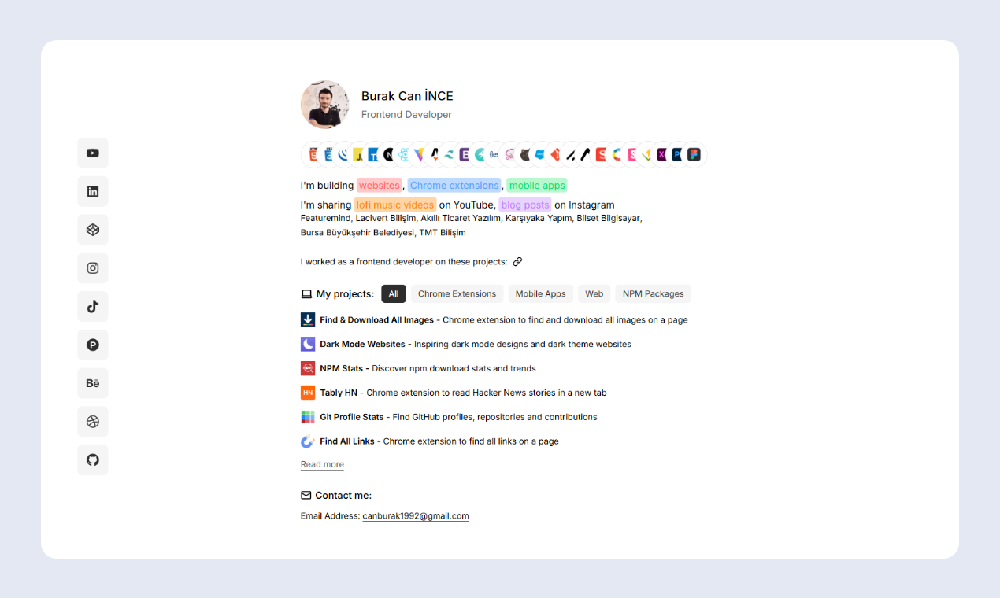

</a>

# Portfolio

A personal portfolio built with Next.js 16, React 19, TypeScript, and Tailwind CSS 4.

## Tech Stack

- [Next.js 16](https://nextjs.org/)
- [React 19](https://react.dev/)
- [TypeScript](https://www.typescriptlang.org/)
- [Tailwind CSS 4](https://tailwindcss.com/)
- [Motion](https://motion.dev/)
- [Lucide React](https://lucide.dev/)
- [React Icons](https://react-icons.github.io/react-icons/)
- [Simple Analytics](https://www.simpleanalytics.com/)

## Project Structure

```text
app/
├── layout.tsx
├── page.tsx
├── not-found.tsx
├── robots.ts
├── sitemap.ts
└── projects/
    └── page.tsx

components/
├── Analytics.tsx
├── Contact.tsx
├── Filters.tsx
├── Footer.tsx
├── ProfileHeader.tsx
├── Projects.tsx
├── SocialSidebar.tsx
├── ThemeToggle.tsx
└── WorkExperience.tsx

data/
├── company.ts
├── project.ts
├── social.ts
└── stack.ts

public/
├── profile.jpg
├── profile2.jpg
├── project-icons/
├── stack/
└── works/
```

## Getting Started

```bash
# Install dependencies
npm install

# Start dev server
npm run dev

# Build for production
npm run build
```

## License

MIT
